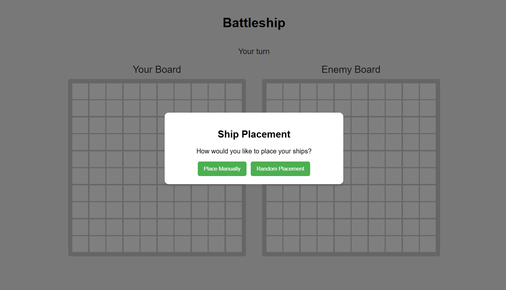

# Battleship Game
A javascript implementation of the classic Battleship board game, focusing on Test-Driven Development (TDD) principles using Jest.



## About the Project

This project is an implementation of the classic Battleship game where players strategically place ships on a grid and take turns guessing the location of their opponent's ships. The game features:

- Ship placement with both random and manual with orientation selection (horizontal/vertical)
- Turn-based gameplay against a computer opponent
- Visual feedback for hits and misses
- Game state tracking and win conditions

## Built With

- JavaScript (ES6+)
- Jest (for TDD)
- Webpack (for bundling)
- HTML5 & CSS3

## Game Overview

The Battleship game follows these core rules:
- Players take turns trying to hit their opponent's ships
- Ships are placed on a 10x10 grid
- When all ships of a player are sunk, the game ends
- The game includes ships of different lengths.

## Getting Started

### Prerequisites
- A modern web browser

### Installation
1. Clone the repository
   ```sh
   git clone https://github.com/codedstrings/battleship.git
   ```
   
2. Install NPM packages
   ```sh
   npm install
   ```

3. Run development server
   ```sh
   npm run dev
   ```

4. To Build 
   ```sh
   npm run build
   ```
5. To Deploy 
   1. Make sure you have all your work committed. You can use git status to see if there’s anything that needs committing.
   2. Run ```git checkout gh-pages && git merge main --no-edit``` to change branch and sync your changes from main so that you’re ready to deploy.
   3. Build the application into Dist using:  ```npm run build```
   4. Commit the dist folder:   ```git add dist -f && git commit -m "Deployment commit"```
   5. Deploy using : ```npm run deploy```
   

## Code Architecture

The project implements the following modules: 

### 1. Ship
Ships have properties for length, hit count, and sunk status, with methods to:
- Record hits
- Report sink status

### 2. Gameboard
The game board manages the 10x10 grid and ships with functionality to:
- Place ships at specific coordinates (horizontally or vertically)
- Validate ship placement to prevent overlap and out-of-bounds placement
- Receive attacks and record hits/misses
- Report if all ships are sunk

### 3. Player
Players manage their own game boards and can:
- Attack enemy boards at specific coordinates
- Automatically place ships randomly
- Track ships and game state

### 4. ComputerPlayer
A specialized player type that:
- Makes random attack moves
- Avoids repeating the same move
- Automatically places ships randomly

### 5. GameController
Manages game flow with functionality to:
- Initialize the game with player and computer
- Handle turn switching
- Process attack logic
- Determine game completion and winners

### 6. GameUI
Handles all DOM interaction including:
- Rendering game boards
- Processing user clicks
- Ship placement interface
- Visual feedback for hits and misses
- Game status updates
- Winner announcement

## Future Enhancements

Potential improvements include:
- Two-player mode
- Drag and drop ship placement
- Enhanced AI strategy with targeted attacks
- Different ship configurations
- Sound effects and animations
- Mobile-responsive design

## Acknowledgments

- [The Odin Project](https://www.theodinproject.com/) for the project requirements and guidance
